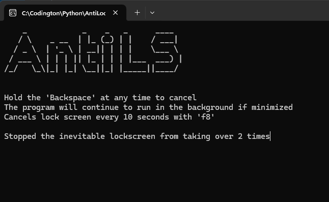

## AntiLockscreen ##
This program is a macro that presses a chosen key in an invterval of a chosen amount of seconds.

My main motivation is that my work decided that all PCs auto locks after 2 minutes of inactivity. Good for security, but annoying when im not using my PC while im at my desk.

## How to run ##

Find and run the "AntiLS.exe" file located in the "dist" folder. If theres a windows security popup, click on "Show more", then "Run anyway".

## How to download ##

Click the green "<>Code" button located above the project files, then at the bottom of the dropdown, click Download ZIP.
